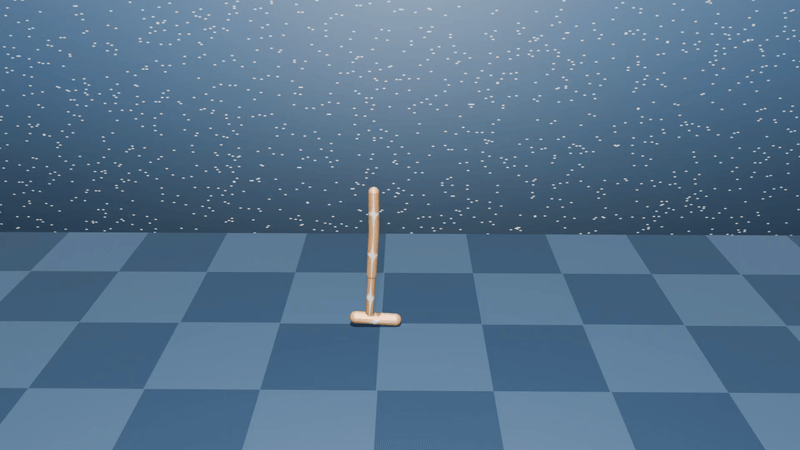
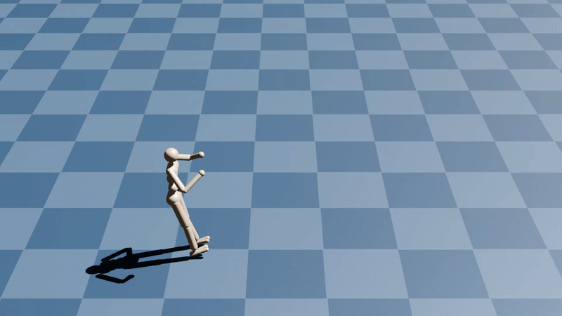

# D.VA
This repository provides an implementation of the paper:
<td style="padding:20px;width:75%;vertical-align:middle">
      <a href="https://haoxiangyou.github.io/Dva_website/" target="_blank">
      <b> Accelerating Visual-Policy Learning through Parallel Differentiable Simulation
      </b>
      </a>
      <br>
      <a href="https://haoxiangyou.github.io/" target="_blank">Haoxiang You</a>,
      <a href="https://yilangliu.github.io/" target="_blank">Yilang Liu</a> and
      <a href="https://ialab.yale.edu/" target="_blank">Ian Abraham</a>
      <br>
      <a href="https://www.arxiv.org/abs/2505.10646">paper</a> /
      <a href="https://haoxiangyou.github.io/Dva_website/" target="_blank">project page</a>
    <br>
</td>

<br>

<p align="center">
  
</p>

<br>
If you use this repo in your research, please consider citing the paper as follows:

```
@misc{you2025acceleratingvisualpolicylearningparallel,
      title={Accelerating Visual-Policy Learning through Parallel Differentiable Simulation}, 
      author={Haoxiang You and Yilang Liu and Ian Abraham},
      year={2025},
      eprint={2505.10646},
      archivePrefix={arXiv},
      primaryClass={cs.LG},
      url={https://arxiv.org/abs/2505.10646}, 
}
```

<br>

This codebase is built on top of various open-source implementations, which we list at the end of this document.

## Installation

### Prerequisites

- `git clone https://github.com/HaoxiangYou/D.VA --recursive`

- In the project folder, create a virtual environment in Anaconda:

  ```
  conda env create -f dva_conda.yml
  conda activate dva
  ```

- Build dflex

  ```
  cd dflex
  pip install -e .
  ```

- Build pytorch3d (only required for SHAC baseline)
  ```
  # Use a prebuilt version of PyTorch3D compatible with PyTorch 2.5.1 and CUDA 12.4
  pip install pytorch3d==0.7.8+pt2.5.1cu124 --extra-index-url https://miropsota.github.io/torch_packages_builder
  ```

### Test Example

A test example can be found in the `examples` folder.

```
python test_env.py --env AntEnv
```

If the console outputs `Finish Successfully` in the last line, the code installation succeeds.


## Instruction

Running the following commands in `examples` folder allows to train Hopper with D.VA.

```
python train_dva.py --cfg ./cfg/dva/hopper.yaml --logdir ./logs/Hopper/dva
```

Evaluation videos will be saved in a directory following the pattern:`logs/Hopper/dva/$DATE/eval`. Evaluation videos are saved every `$save_interval` training episodes, as specified in the corresponding YAML configuration file, e.g., `cfg/dva/hopper.yaml`.

To run `curl`, or `state2visDagger` use the following command:
```
python train_$method.py --cfg ./cfg/$method/hopper.yaml --logdir ./logs/Hopper/$method
```
where $method is the desired baseline name.


To run `drqv2`, using the following command:
```
python train_drqv2.py task=hopper
```

To run `dreamerv3`, using the following command:

```
python --configs dflex_vision --task dflex_$env --logdir ./logs/dreamerv3/$env 
```
where `$env` is the name of the environment (e.g., hopper, humanoid, etc.).

To run `SHAC with differentiable rendering`, using the following command
```
python train_shac.py --cfg ./cfg/shac/hopper_vis.yaml  --logdir ./logs/Hopper/shac
```
Note, the SHAC baseline requires environments with differentiable rendering, which differs from other methods that use ManiSkill as the default rendering engine.

To run our method (D.VA) under the same `differentiable rendering`, simply replace the config file:`cfg/dva/hopper.yaml` to `cfg/dva/diff_render_hopper.yaml` 

## Methods

### D.Va

D.Va is a quasi-analytical policy gradient algorithm for learning image-based continuous control tasks. It extends [SHAC](https://github.com/NVlabs/DiffRL) to operate directly from pixels by decoupling the rendering process from the gradient computation pipeline.
<p align="center">
  
</p>
This decoupling brings several key benefits:

- 📉 Reduced memory usage: Jacobians from the rendering process are dropped, significantly lowering memory requirements.

- ⚡ Faster backward pass: Omitting large Jacobian matrices during rendering results in a 2–3× speedup in gradient computation.

- 🎯 Smoother optimization: Gradient norms are better normalized, leading to more stable and efficient training.

- 🔄 No need for external differentiable renderers: D.VA avoids dependence on additional differentiable rendering software.

### 🧩 Differentiable Rendering for Robot Learning

Although <strong>D.VA</strong> does not require any additional differentiable rendering software, we also provide optional differentiable rendering modules as part of this project for advanced use cases and experimentation.
Most implementations are located in the `viewer/torch3d_robo` directory.
A standalone version of this differentiable rendering library is also available in a [separate repository](https://github.com/HaoxiangYou/torch3d_robo).

## Results

### 🎥 Examples of Training
We provide example videos demonstrating how D.VA learns to control using <strong>only pixel-based observations</strong>. 

The experiments are conducted on a single RTX 4080 GPU.

#### Training Hopper
<table>
  <tr>
    <td align="center" width="25%">
      <br>
      <p style="font-size:10px;">Iter 0 (initial policy)</p>
    </td>
    <td align="center" width="25%">
      <br>
      <p style="font-size:10px;">Iter 400 (4 minutes)</p>
    </td>
    <td align="center" width="25%">
      <br>
      <p style="font-size:10px;">Iter 8000 (1 hour)</p>
    </td>
    <td align="center" width="25%">
      <br>
      <p style="font-size:10px;">Iter 17600 (2.5 hours)</p>
    </td>
  </tr>
</table>

#### Training Humanoid

<table>
  <tr>
    <td align="center" width="25%">
      <br>
      <p style="font-size:10px;">Iter 0 (initial policy)</p>
    </td>
    <td align="center" width="25%">
      <br>
      <p style="font-size:10px;">Iter 4400 (2 hours)</p>
    </td>
    <td align="center" width="25%">
      <br>
      <p style="font-size:10px;">Iter 9600 (4 hours)</p>
    </td>
    <td align="center" width="25%">
      <br>
      <p style="font-size:10px;">Iter 36000 (15 hours)</p>
    </td>
  </tr>
</table>


### Comparison to baselines

We present a comparison of training curves between our method and existing visual-policy learning baselines.

Our approach significantly improves both wall-clock training efficiency and final performance across a range of challenging control tasks.

<p align="center">
  
</p>
<p align="center">
  
</p>
<p align="center">
  
</p>

## Common issues

- RuntimeError: Error building extension 'kernels' for dflex environment

  This is due to cuda compute capability. Change the line 1861 in the [adjoint.py](dflex/dflex/adjoint.py)
  ```
  cuda_flags = ['-gencode=arch=compute_86,code=compute_86']
  ``` 
  to the one matches your cuda version.
  For more information, please refer to [this issue](https://github.com/NVlabs/DiffRL/issues/12).

- Installing pytorch3d

  We found the official installation process for PyTorch3D to be challenging. As a workaround, we recommend using a third-party installation approach, as outlined in [this discussion thread](https://github.com/facebookresearch/pytorch3d/discussions/1752).

## Licenses

All redistributed code from [DiffRL](https://github.com/NVlabs/DiffRL) retains its original [license](LICENSES/DiffRL/LICENSE.md).

XML files from [dm_control](https://github.com/google-deepmind/dm_control) are licensed under the [Apache 2.0 License](https://github.com/google-deepmind/dm_control/blob/main/LICENSE).

All other code in this repository is licensed under the MIT License.

## Acknowledgement

1. Our codebase is built on top of [SHAC](https://github.com/NVlabs/DiffRL) by Jie Xu (NVIDIA).

2. CURL implementation is based on the original [repository](https://github.com/MishaLaskin/curl) by Michael Laskin.

3. DrQv2 implementation is based on the original [repository](https://github.com/facebookresearch/drqv2) by Denis Yarats (Facebook Research).

4. DreamerV3 implementation is based on the [pytorch reimplementation](https://github.com/NM512/dreamerv3-torch) by Naoki Morihira.

5. We refer the [pytorch_kinematics](https://github.com/UM-ARM-Lab/pytorch_kinematics) , developed by the Autonomous Robotic Manipulation Lab at the University of Michigan, Ann Arbor, to construct the `forward kinematics tree` used in our [differentiable rendering pipeline](https://github.com/HaoxiangYou/torch3d_robo).
We have made several modifications to support floating-base systems and multiple joints definition under single link.